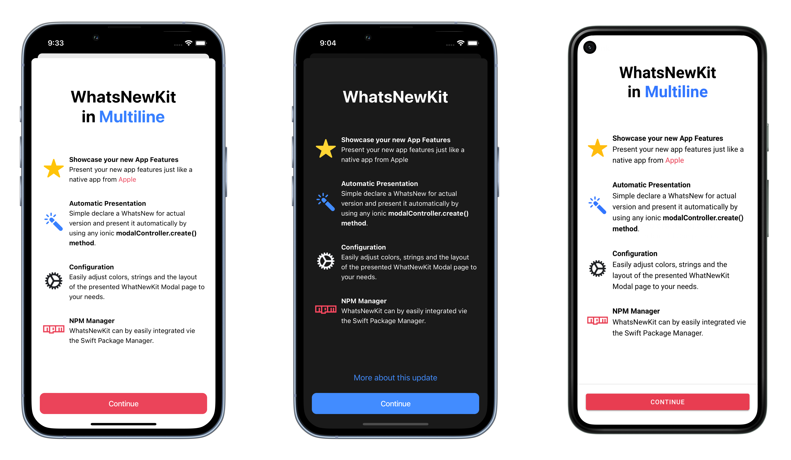

<br>
<p align="center">
    
</p>

<h1 align="center">
    WhatsNewKit for Ionic (Angular)
</h1>

<p align="center">
    A NPM Package to easily showcase your new app features in your Ionic Angular App.
    <br/>
    It's designed from the ground up to be fully customized to your needs.
</p>

<p align="center">
    Original Swift Package <a href="https://github.com/SvenTiigi/WhatsNewKit/">SvenTiigi/WhatsNewKit</a>
</p>


<p align="center">
   <a href="projects/whats-new-kit">
      
   </a>
   
   <a href="https://awwwesome.cz">
      
   </a>
</p>


## Features

- [x] Easily present your new app features 🤩
- [x] Automatic & Manual presentation mode ✅
- [x] Dark mode ready ☑️
- [x] Use Ionic Theming Colors 🎨
- [x] Support for Ionic - Angular and Capacitor 🧑‍🎨
- [x] Support any platform: iOS, macOS, iPadOS, Android, Web & Electron 📱 🖥
- [x] Adjustable content 🔧

See complete documentation in [Project page](projects/whats-new-kit).

## Installation

1. Download package from NPM using `npm i ...`
2.

## Example

<p align="center">
    
</p>

## Development info

1. Developing library in [projects](projects) like `whats-new-kit`.
2. Run `ng build` or `ng build --watch` (for live reload) for build dev distribution of lib.
3. Go to `cd dist/whats-new-kit` or different lib.
4. Run `npm link` for link dev distribution to global node_modules folder.

### Testing in real application

1. Create blank Ionic application `ionic start dist-test-app blank --type=angular --capacitor`
2. Go to ionic blank app
3. Run `npm link whats-new-kit` for link dev dist distribution from global node_modules folder.
4. Open `angular.json` in test app and add `"preserveSymlinks": true`

```json
{
  // ...
  "projects": {
    "app": {
      // ...
      "architect": {
        "build": {
          // ...
          "options": {
            "preserveSymlinks": true
            // <--- add this
            // ...
          }
        }
      }
    }
  }
```

## Licence

WhatsNewKit for Ionic (Angular)

Copyright (c) 2022 Ing. Jakub Josef Forman forman@awwwesome.cz

Permission is hereby granted, free of charge, to any person obtaining a copy
of this software and associated documentation files (the "Software"), to deal
in the Software without restriction, including without limitation the rights
to use, copy, modify, merge, publish, distribute, sublicense, and/or sell
copies of the Software, and to permit persons to whom the Software is
furnished to do so, subject to the following conditions:

The above copyright notice and this permission notice shall be included in
all copies or substantial portions of the Software.

THE SOFTWARE IS PROVIDED "AS IS", WITHOUT WARRANTY OF ANY KIND, EXPRESS OR
IMPLIED, INCLUDING BUT NOT LIMITED TO THE WARRANTIES OF MERCHANTABILITY,
FITNESS FOR A PARTICULAR PURPOSE AND NONINFRINGEMENT. IN NO EVENT SHALL THE
AUTHORS OR COPYRIGHT HOLDERS BE LIABLE FOR ANY CLAIM, DAMAGES OR OTHER
LIABILITY, WHETHER IN AN ACTION OF CONTRACT, TORT OR OTHERWISE, ARISING FROM,
OUT OF OR IN CONNECTION WITH THE SOFTWARE OR THE USE OR OTHER DEALINGS IN
THE SOFTWARE.
